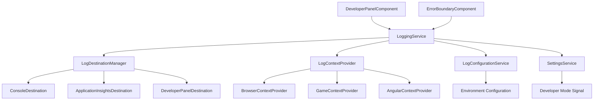

# Design Document

## Overview

The Stellar Remnants logging service provides a comprehensive, multi-destination logging solution that integrates seamlessly with the existing Angular architecture. The service follows the established patterns in the codebase, using signals for reactive state management and dependency injection for service composition.

The logging service will support multiple output destinations (console, Application Insights, developer panel), provide rich error context, and integrate with a new developer mode setting. The design emphasizes performance, reliability, and developer experience while maintaining the project's architectural principles.

## Architecture

### Service Architecture

The logging system follows a modular architecture with clear separation of concerns:



### Integration Points

- **SettingsService**: Extended with developer mode signal
- **Environment Configuration**: Enhanced with logging-specific settings
- **Angular Error Handler**: Custom error handler that routes to logging service
- **Developer Panel**: New component for real-time error display

## Components and Interfaces

### Core Logging Service

```typescript
interface LogEntry {
  id: string;
  timestamp: Date;
  level: LogLevel;
  message: string;
  metadata?: Record<string, any>;
  context: LogContext;
  source?: string;
}

interface LogContext {
  browser: BrowserContext;
  game?: GameContext;
  angular?: AngularContext;
  custom?: Record<string, any>;
}

interface LogDestination {
  name: string;
  isEnabled: boolean;
  log(entry: LogEntry): Promise<void>;
  configure(config: any): void;
}

enum LogLevel {
  DEBUG = 0,
  INFO = 1,
  WARN = 2,
  ERROR = 3
}
```

### Configuration Interfaces

```typescript
interface LoggingConfiguration {
  level: LogLevel;
  destinations: {
    console: ConsoleDestinationConfig;
    applicationInsights: ApplicationInsightsConfig;
    developerPanel: DeveloperPanelConfig;
  };
  rateLimiting: RateLimitConfig;
  batching: BatchingConfig;
}

interface ApplicationInsightsConfig {
  enabled: boolean;
  instrumentationKey?: string;
  endpoint?: string;
  batchSize: number;
  flushInterval: number;
}
```

### Settings Service Extension

```typescript
// Extension to existing SettingsService
class SettingsService {
  // ... existing properties
  readonly developerMode = signal<boolean>(false);
  
  toggleDeveloperMode(enabled: boolean) {
    this.developerMode.set(enabled);
  }
}
```

## Data Models

### Log Entry Structure

The log entry model captures comprehensive information about each logged event:

- **Core Fields**: ID, timestamp, level, message
- **Context Data**: Browser, game state, Angular component context
- **Metadata**: Custom key-value pairs for additional information
- **Source Tracking**: Component or service that generated the log

### Context Providers

Each context provider is responsible for gathering specific environmental information:

- **BrowserContextProvider**: User agent, viewport, performance metrics
- **GameContextProvider**: Current game state, player information, turn number
- **AngularContextProvider**: Component tree, route information, change detection context

## Correctness Properties

*A property is a characteristic or behavior that should hold true across all valid executions of a system-essentially, a formal statement about what the system should do. Properties serve as the bridge between human-readable specifications and machine-verifiable correctness guarantees.*

### Property Reflection

After analyzing all acceptance criteria, several properties can be consolidated:
- Properties 2.1, 2.2, and 2.4 can be combined into a comprehensive destination routing property
- Properties 4.1 and 4.3 can be merged into a single developer mode event emission property
- Properties 6.1, 6.2, 6.3, and 6.4 can be consolidated into a comprehensive context capture property

### Core Logging Properties

**Property 1: Structured Log Data Acceptance**
*For any* valid log message with level, timestamp, and metadata, the Logging_Service should accept and process the log entry without errors
**Validates: Requirements 1.2**

**Property 2: Log Level Support**
*For any* supported log level (error, warn, info, debug), the Logging_Service should correctly process and route the message
**Validates: Requirements 1.3**

**Property 3: Automatic Metadata Inclusion**
*For any* log message, the service should automatically include timestamp and source context in the final log entry
**Validates: Requirements 1.4**

### Destination Routing Properties

**Property 4: Multi-Destination Routing**
*For any* log entry and any configured destination set, the service should route the message to all enabled destinations and skip disabled ones
**Validates: Requirements 2.1, 2.2, 2.4**

**Property 5: Destination Failure Isolation**
*For any* log entry, if one destination fails, all other configured destinations should continue to receive and process the log message
**Validates: Requirements 2.5**

**Property 6: Developer Mode Event Emission**
*For any* log entry when developer mode is enabled, the service should emit the entry through the observable stream, and when developer mode is disabled, no events should be emitted
**Validates: Requirements 2.3, 4.1, 4.3**

### Settings Integration Properties

**Property 7: Developer Mode Signal Behavior**
*For any* boolean value, the Settings_Service developer mode signal should accept the value and maintain it correctly
**Validates: Requirements 3.1**

**Property 8: Settings Persistence**
*For any* developer mode toggle operation, the Settings_Service should update its internal state to reflect the new value
**Validates: Requirements 3.3**

### Error Display Properties

**Property 9: Developer Panel Error Display**
*For any* error entry when developer mode is active, the developer panel should display the error with timestamp, level, message, and metadata
**Validates: Requirements 4.4**

### Application Insights Properties

**Property 10: Application Insights Integration**
*For any* log entry when Application Insights is configured and enabled, the service should format and transmit the data to the Application Insights endpoint
**Validates: Requirements 5.1, 5.2, 5.3**

**Property 11: Application Insights Failure Handling**
*For any* Application Insights connection failure, the logging service should continue operating normally without throwing errors
**Validates: Requirements 5.4**

**Property 12: Environment Configuration**
*For any* environment setting change, the Application Insights destination should reflect the new configuration
**Validates: Requirements 5.5**

### Context Capture Properties

**Property 13: Comprehensive Context Capture**
*For any* log entry, the service should include browser information, and when applicable, game state context, Angular context, and any custom metadata
**Validates: Requirements 6.1, 6.2, 6.3, 6.4**

**Property 14: Context Serialization**
*For any* log entry with context data, all context information should be serializable to JSON without data loss
**Validates: Requirements 6.5**

### Performance and Reliability Properties

**Property 15: External Logging Error Isolation**
*For any* external logging service failure, the main application should continue functioning without receiving error exceptions
**Validates: Requirements 7.2**

**Property 16: Rate Limiting Behavior**
*For any* sequence of log messages exceeding the configured rate limit, the service should throttle messages appropriately while preserving the most recent entries
**Validates: Requirements 7.3**

**Property 17: Message Batching**
*For any* series of log messages to external services, the service should batch messages according to configuration and transmit them efficiently
**Validates: Requirements 7.4**

### Configuration Properties

**Property 18: Environment-Specific Configuration**
*For any* environment (development/production), the logging service should apply the appropriate configuration settings for that environment
**Validates: Requirements 8.1**

**Property 19: Runtime Configuration Changes**
*For any* configuration change to log levels or destinations, the service should immediately apply the new settings to subsequent log entries
**Validates: Requirements 8.5**

## Error Handling

### Error Isolation Strategy

The logging service implements multiple layers of error isolation:

1. **Destination Isolation**: Failures in one destination don't affect others
2. **Async Operation Protection**: External service calls are wrapped in try-catch blocks
3. **Fallback Mechanisms**: Console logging as ultimate fallback
4. **Circuit Breaker Pattern**: Temporary disabling of failing destinations

### Error Recovery

- **Retry Logic**: Exponential backoff for transient failures
- **Graceful Degradation**: Reduced functionality rather than complete failure
- **Health Monitoring**: Periodic checks to re-enable failed destinations

## Testing Strategy

### Dual Testing Approach

The logging service will be validated through both unit tests and property-based tests:

**Unit Tests**: Focus on specific examples, edge cases, and integration points
- Settings service integration
- Component rendering verification
- Error boundary behavior
- Configuration loading

**Property Tests**: Verify universal properties across all inputs using fast-check
- Each property test will run minimum 100 iterations
- Tests will generate random log data, configurations, and error scenarios
- Each test will be tagged with: **Feature: logging-service, Property {number}: {property_text}**

### Testing Configuration

- **Framework**: Jasmine with Angular Testing Utilities
- **Property Testing Library**: fast-check for TypeScript
- **Mock Strategy**: Mock where it makes sense. Most things should be injectable anyway.
- **Test Environment**: Configured with `provideZonelessChangeDetection()`

### Test Coverage Areas

1. **Service Integration**: Dependency injection, signal reactivity
2. **Destination Routing**: Message delivery to multiple outputs
3. **Error Scenarios**: Failure handling and recovery
4. **Performance**: Rate limiting and batching behavior
5. **Configuration**: Environment-specific and runtime changes
6. **UI Components**: Developer panel rendering and interaction