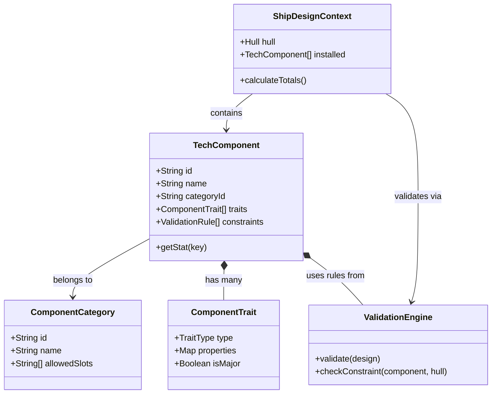

# Technology Data Model & Architecture Refresh

## 1. Executive Summary
This document outlines the architectural plan to transition the **Stars! Mobiler** technology system from a hardcoded, static model to a fully data-driven, trait-based architecture. This change enables complex component behaviors (e.g., multi-purpose components), robust validation, and a dynamic UI that adapts to component capabilities without code changes.

## 2. Current State Analysis
*   **Hardcoded Types**: Components rely on fixed string literals (`type: 'Weapon'`) matching a hardcoded TypeScript union. Adding a new type requires changing code in multiple files.
*   **Flat Properties**: `ComponentStats` is a monolithic interface containing all possible stats (`damage`, `miningRate`, `colonists`). Most fields are undefined for any given component.
*   **Brittle Validation**: Validation logic is embedded in `ship-design.model.ts` inside complex `if/else` blocks.
*   **Naming Inconsistencies**: Duplicate concepts like `orb` vs `orbital` exist in different data files.

## 3. Proposed Data Model

### 3.1 Core Concepts
We will move to a **Composition over Inheritance** model using **Traits**.

*   **Component Definition**: The core identity of a tech item.
*   **Category**: Defines broad behavior (e.g., "Orbital", "Ship Module").
*   **Traits**: Granular capabilities (e.g., `Emitter`, `Storage`, `Sensor`).
*   **Stats**: Dynamic key-value pairs associated with Traits.

### 3.2 Type Definitions

```typescript
// 1. The Registry of all Component Categories
// Replaces hardcoded strings like 'Weapon' | 'Engine'
export interface ComponentCategory {
  id: string;          // e.g., 'beam_weapon', 'planetary_shield'
  name: string;        // e.g., 'Beam Weapon'
  allowedSlots: string[]; // e.g., ['General', 'Weapon']
  displayOrder: number;
}

// 2. The Trait System
// Defines WHAT a component does
export type TraitType = 
  | 'damage_dealer' 
  | 'propulsion' 
  | 'storage' 
  | 'sensor' 
  | 'cloak' 
  | 'mining' 
  | 'terraform';

export interface ComponentTrait {
  type: TraitType;
  // Dynamic properties specific to the trait
  // e.g., for 'damage_dealer': { damage: 10, range: 2, accuracy: 90 }
  properties: Record<string, number | string | boolean>;
  
  // Visibility rules (Major traits appear in summaries)
  isMajor: boolean;
}

// 3. The New Component Model
export interface TechComponent {
  id: string;
  name: string;
  categoryId: string; // Foreign Key to ComponentCategory
  
  // Base Stats
  mass: number;
  cost: ResourceCost;
  requirements: TechRequirement;
  
  // Composition
  traits: ComponentTrait[];
  
  // Validation Constraints
  constraints: ValidationRule[];
  
  // Dynamic Rendering Metadata
  metadata: {
    icon: string;
    color?: string;
    description: string;
  };
}
```

## 4. Validation Layer

Validation logic will be extracted from `compileShipStats` into a dedicated **Rule Engine**.

### 4.1 Validation Rules
Rules are declarative and attached to Components or Hulls.

```typescript
export type ValidationRuleType = 
  | 'max_per_hull' 
  | 'exclusive_to_hull_type' 
  | 'requires_trait' 
  | 'mutually_exclusive';

export interface ValidationRule {
  type: ValidationRuleType;
  params: any; 
  errorMessage: string;
}

// Example: Stargate Constraint
{
  type: 'exclusive_to_hull_type',
  params: { hullTypes: ['Starbase', 'Freighter'] }, // Can't put stargates on warships
  errorMessage: "Stargates can only be mounted on Starbases or Freighters"
}
```

## 5. Dynamic UI & Rendering

### 5.1 Adaptive Component Renderer
Instead of hardcoding "If weapon, show damage", the UI will iterate over **Traits**.

*   **TraitRegistry**: A service mapping `TraitType` to a UI Component or Template.
    *   `damage_dealer` -> `DamageStatComponent` (Shows Icon + Value + Range)
    *   `storage` -> `CapacityBarComponent`
*   **Context Awareness**: Stats will be calculated via a `StatContext` (e.g., Hull bonuses applied to base component stats).

## 6. Migration Strategy

1.  **Phase 1: Dual Support**: Update `Component` interface to include optional `traits` and `categoryId` while keeping legacy fields.
2.  **Phase 2: Data Migration**: Write a script to convert `weapons.data.ts` entries into the new format, mapping properties to Traits.
3.  **Phase 3: Service Layer Update**: Update `ShipDesignService` to use the new Validation Engine.
4.  **Phase 4: UI Update**: Replace static stat blocks with the Dynamic Trait Renderer.
5.  **Phase 5: Cleanup**: Remove legacy fields from `Component`.

## 7. Architectural Diagram



## 8. Next Steps (Implementation)
1.  Create `src/app/models/tech-new.model.ts` with new interfaces.
2.  Create `src/app/services/validation.service.ts`.
3.  Prototype `weapons.data.ts` migration for one category (e.g., Lasers).
